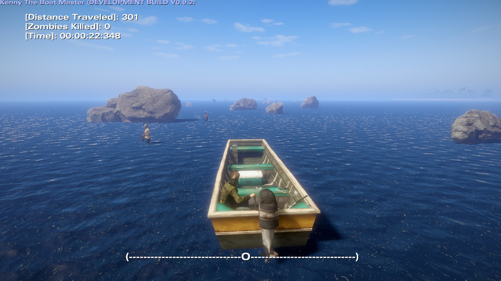

# Kenny The Boat Master
Kenny The Boat Master (KTBM) is a game mod for The Walking Dead Telltale Definitive Edition

### DISCLAIMER: This is still a work in progress and is not yet a full complete mod.

# Screenshots

# About

Kenny is out relaxing and fishing on his boat in the open water, before he is then ambushed by a zombie horde, and must flee in order to survive. It will be a small but simple (temple run/subway surfer) style mini-game where you steer Kenny's boat to dodge obstacles in the water and get bonus points crushing zombies with your boat along the way.

This project is fully custom and built entirely using Lua scripts which is the native Telltale gameplay programming language used in their games *(games released before The Expanse: A Telltale Series)*. It features custom UI, cutscenes, gameplay controls and input, procedural generation, collision detection, file saving, and improved lighting. All of the code is well documented and explained.

***NOTE: This project requires that the user owns a copy of The Walking Dead: Telltale Definitive Series on PC, as it's an add-on, not a standalone game.***

# Tools Used

Listed here are tools that were used to make the project, or were used to help assist in certain parts of it.

### [Telltale Script Editor 3.0.0](https://github.com/Mawrak/Telltale-Script-Editor-Tweaks)

This was the primary editor for the project, it's where the main creation, script editing, and building of the project takes place. We make heavy use of the Build and Run feature which deploys the mod to the game and launches it, used in conjunction with the [Load Any Level](https://www.nexusmods.com/thewalkingdeadthetelltaledefinitiveseries/mods/7?tab=description) mod this makes iteration time in development almost instantaneous.

### [Load Any Level](https://www.nexusmods.com/thewalkingdeadthetelltaledefinitiveseries/mods/7?tab=description)

This is another crucial tool that is secondary to the script editor. This mod helps rapidly speed up iteration time by skipping the game's title sequence and booting straight into the custom-level scripts for the project.

### [DDS D3DTX Converter](https://github.com/Telltale-Modding-Group/DDS-D3DTX-Converter)

This is a tool occasionally used for the project for the creation of custom telltale *.d3dtx* textures that can be used in the Telltale Tool. The custom textures are also included in the project.

### [IMAP Editor](https://github.com/Telltale-Modding-Group/IMAP-Editor)

This tool is occasionally used for the project for the creation of custom telltale *.imap* files. These are responsible for most of the input and actions you have in the game. Though not all of them, as some, will need to be hardcoded in the LUA scripts. The custom *.imap* are in the project as well as the *.json* files which are custom editable versions of the *.imap* files generated by the IMAP editor.

### [Telltale Explorer](https://quickandeasysoftware.net/software/telltale-explorer)

This tool is occasionally used for the project for the extraction of certain assets of various types from the game files for modification's sake. Though it's primarily used as a documentation tool to see what files are located in what archives for scripting purposes.
